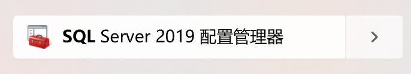
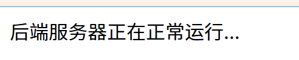

# order-management
# 点餐管理系统

## 使用指南：
#### 环境需求：node 18 + react + express
### 1.首先需要配置一下本地数据库，在数据库里面输入本项目database文件夹的`order.sql`文件，来创建相对应的初始数据库。除此之外数据库的sa密码要正确填入backend的`.env`文件。

### 2.然后打开电脑上的sql server配置管理器，在里面启动TCP/IP协议，默认端口1433，在本地防火墙也要添加允许这个端口通过（如果需要的话）。


```js
ps:此步不能改数据库的1433端口，否则会报错。1433是默认端口。
```
### 3.下面配置后端的`.env`文件。
具体内容应该如下：
```bash
DB_USER=
DB_PASSWORD=
DB_SERVER=
DB_NAME=
JWT_SECRET=
PORT=
```
1.DB_USER为了图方便我直接sa，生产环境应该是别的情况。</br>
2.DB_PASSWORD填你的密码，我这里就是sa的密码。</br>
3.DB_SERVER本地就是localhost，云端填你云端数据库的远程服务器的 IP 地址或者域名。</br>
4.DB_NAME我这里就是OrderManagement，你可以改成你起的数据库名，但一定要对应上。</br>
5.JWT_SECRET是中间件的验证密钥，你可以自己想一个复杂的或者用工具生成。</br>
6.PORT由于我是本地我就填了5000,如果是远程服务器就填远程服务器端口，例如8080.</br>

### 4.此时应该就可以运行后端服务器了，具体步骤如下：
1.切换到`/backend`文件夹下面：</br>
```bash
cd backend
```
2.下载依赖：
```bash
npm install
```
3.运行后端服务器：
```bash
node server.js
```
4.检验：</br>

此时打开端口应当看到正常启动服务器，如若没有请根据报错信息排查。


### 5.前端配置：
1.前端的`.env`文件配置：
```s
# 服务器的 API 基础 URL
REACT_APP_API_URL=

# 应用模式（例如开发模式）
REACT_APP_MODE=
```
URL填写你服务器端口的url，例如我的本地就是http://localhost:3000

mode可以不管他，是为了区分处于哪一种环境下的。

2.下载模块：</br>
```bash
cd frontend/order-management-frontend
npm install 
```
3.启动前端服务：
```bash
cd frontend/order-management-frontend
npm start
```
4.此时前端应该能正常运行，可以在浏览器端口中查看并且与后端和数据库进行交互了。